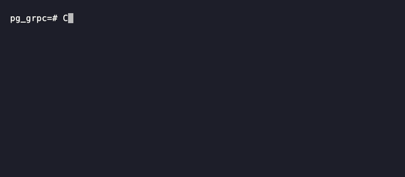

<div align="center">

# pg_grpc

**Make gRPC calls directly from PostgreSQL SQL.**

[](https://github.com/CSenshi/pg_grpc/actions/workflows/test.yml)
[](https://github.com/CSenshi/pg_grpc/releases/latest)
[](LICENSE)
[](#)
[](#)



</div>


`pg_grpc` turns any gRPC service into a first-class SQL function call. Invoke RPCs from triggers, materialized views, scheduled jobs or ad-hoc queries - no codegen, no middleware, no app-layer glue.

## Quickstart: stage protos and call

### 1. Compile protos

```sql
SELECT grpc_proto_stage('common.proto', $PROTO$
    syntax = "proto3";
    package auth;
    message UserId { string id = 1; }
    message User {
      string id = 1;
      string email = 2;
    }
$PROTO$);

SELECT grpc_proto_stage('auth.proto', $PROTO$
    syntax = "proto3";
    import "common.proto";
    package auth;
    service AuthService {
      rpc GetUser(UserId) returns (User);
    }
$PROTO$);

SELECT grpc_proto_compile();
```


> **Optional.** Skip this step if your server exposes gRPC reflection — `grpc_call` will resolve schemas automatically. 

### 2. Call the service

```sql
SELECT grpc_call(
    'localhost:50051',
    'auth.AuthService/GetUser',
    '{"id": "42"}'::jsonb
);
```

## Proto management API

| Function                              | Description                                |
| ------------------------------------- | ------------------------------------------ |
| `grpc_proto_stage(filename, source)`  | Stage a `.proto` file for the next compile |
| `grpc_proto_unstage(filename)`        | Remove one staged file                     |
| `grpc_proto_unstage_all()`            | Clear all staged files                     |
| `grpc_proto_compile()`                | Parse + compile staged files               |
| `grpc_proto_unregister(service_name)` | Remove one compiled service                |
| `grpc_proto_unregister_all()`         | Remove all compiled services               |
| `grpc_proto_list_staged()`            | List all staged `.proto`                   |
| `grpc_proto_list_registered()`        | List all registered services               |


## Errors

All errors raise a PostgreSQL `ERROR` and abort the current statement:

| Prefix                   | Cause                                                                       |
| ------------------------ | --------------------------------------------------------------------------- |
| `Connection error: …`    | Could not reach the endpoint                                                |
| `Proto error: …`         | Reflection failed, symbol not found, or JSON ↔ protobuf encode/decode error |
| `Proto compile error: …` | `grpc_proto_compile` failed to parse/resolve the staged files               |
| `gRPC call failed: …`    | Server returned a non-OK gRPC status                                        |
| `Request timeout: …ms`   | The call (connect + reflection + unary) did not finish within `timeout_ms`  |

## Limitations

- **HTTP only** — TLS/mTLS not supported
- **Unary only** — streaming methods not supported
- **No caching** — a new connection and (for the reflection path) a new reflection request are made on every call
- **Endpoint format** — `host:port`, never include a scheme
- **Reflection** — required unless you use `grpc_proto_stage` + `grpc_proto_compile`
- **Per-connection state** — the staged/registered protos live inside a single Postgres backend; new connections start empty
