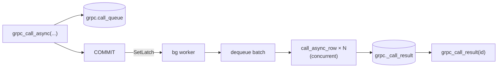

> For the complete documentation index, see [llms.txt](pathname:///pg_grpc/llms.txt)

# Async calls

`grpc_call` is synchronous - the SQL statement blocks until the gRPC server replies. `grpc_call_async` enqueues the call instead, returning an `id` immediately. A background worker executes the call and stores the result; you fetch it later with `grpc_call_result`.

Use async when you need to:
- Fan out many calls in parallel without holding a connection per call.
- Tolerate slow or unreliable backends without stalling your transaction.
- Decouple the calling transaction from the network round-trip.

## How it works



The worker runs as a Postgres background worker process. It wakes up the moment a committing transaction sets the latch, dequeues up to `pg_grpc.batch_size` rows, executes all calls concurrently on a single-threaded async runtime, then persists the results. Old results are TTL-cleaned in the same cycle.

## Basic usage

```sql
-- Enqueue. Returns a bigint id immediately.
SELECT grpc_call_async(
  'localhost:50051',
  'auth.AuthService/GetUser',
  '{"id": "42"}'::jsonb
);
-- 1

-- Poll for the result.
SELECT status, response, message
FROM grpc_call_result(1);
--  status  |         response          | message
-- ---------+---------------------------+---------
--  SUCCESS | {"id":"42","email":"..."} |
```

`status` is `PENDING` while the worker hasn't finished yet, `SUCCESS` on completion, or `ERROR` if the call failed.

## Blocking wait

Pass `async => false` to block until the result is ready instead of polling:

```sql
SELECT status, response
FROM grpc_call_result(1, async => false);
```

This polls at 50 ms intervals using a `WaitLatch` timeout. The background worker does not signal the caller's latch when it writes a result, so the wait is purely time-based. Useful in scripts or tests where you want the result inline without writing a loop.

## With metadata and options

Both parameters work the same as in `grpc_call`. Options are validated at enqueue time - bad values raise an error before any row is inserted.

```sql
SELECT grpc_call_async(
  'localhost:50051',
  'auth.AuthService/GetUser',
  '{"id": "42"}'::jsonb,
  metadata => '{"authorization": "Bearer abc"}'::jsonb,
  options  => '{"timeout_ms": 5000, "use_reflection": true}'::jsonb
);
```

## Fan-out pattern

Call `grpc_call_async` in a set-returning context to enqueue one call per row in a single transaction. The worker picks them all up as a batch:

```sql
SELECT grpc_call_async(
  'localhost:50051',
  'notify.NotifyService/Send',
  jsonb_build_object('user_id', user_id)
)
FROM users
WHERE notify_at < now();
```

## Rollback safety

If the transaction that calls `grpc_call_async` is rolled back, the queue row is rolled back with it and the worker is never signaled. The worker is only woken on a real commit.

## Configuration

The background worker is configured via `postgresql.conf` (or `ALTER SYSTEM`). The two identity settings (`database_name`, `username`) require a server restart because they are read at startup. The operational settings (`ttl`, `batch_size`) take effect on the next `SIGHUP`.

| GUC                      | Type    | Default       | Reload          | Description                                             |
| ------------------------ | ------- | ------------- | --------------- | ------------------------------------------------------- |
| `pg_grpc.database_name`  | string  | `postgres`    | restart         | Database the worker connects to.                        |
| `pg_grpc.username`       | string  | (superuser)   | restart         | Role the worker runs as. `NULL` = bootstrap superuser.  |
| `pg_grpc.batch_size`     | integer | `200`         | SIGHUP          | Max rows dequeued per worker cycle.                     |
| `pg_grpc.ttl`            | string  | `6 hours`     | SIGHUP          | How long completed results are retained before cleanup. |

Minimal `postgresql.conf` setup:

```ini
shared_preload_libraries = 'pg_grpc'
pg_grpc.database_name = 'mydb'
pg_grpc.username = 'grpc_worker'
```

## Schema

Two unlogged tables are created by the extension:

**`grpc.call_queue`** - pending and in-flight calls. Rows are deleted once the worker moves them to `_call_result`.

| Column       | Type       | Notes                                          |
| ------------ | ---------- | ---------------------------------------------- |
| `id`         | bigserial  | Primary key; returned by `grpc_call_async`.    |
| `endpoint`   | text       | `host:port` of the gRPC server.                |
| `method`     | text       | `pkg.Service/Method`.                          |
| `request`    | jsonb      | Request body.                                  |
| `metadata`   | jsonb      | gRPC headers. `NULL` if not supplied.          |
| `options`    | jsonb      | Per-call options blob. `NULL` if not supplied. |
| `timeout_ms` | int        | Resolved at enqueue time from `options`.       |

**`grpc._call_result`** - completed results, cleaned up after `pg_grpc.ttl`.

| Column      | Type        | Notes                                    |
| ----------- | ----------- | ---------------------------------------- |
| `id`        | bigint      | Same id as the `call_queue` row.         |
| `status`    | text        | `SUCCESS` or `ERROR`.                    |
| `response`  | jsonb       | Decoded response. `NULL` on error.       |
| `error_msg` | text        | Error string. `NULL` on success.         |
| `created`   | timestamptz | When the result was stored; TTL anchor.  |
