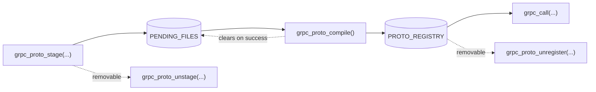

# User-supplied protos

When your gRPC server doesn't expose [reflection](https://grpc.io/docs/guides/reflection/) or when you want a pinned, deterministic schema, supply the `.proto` source directly.

## Lifecycle

The lifecycle is **stage → compile → call**, with separate uninstall steps.



A typical flow:

```sql
-- Stage one file per logical .proto
SELECT grpc_proto_stage('common.proto', $$ ... $$);
SELECT grpc_proto_stage('auth.proto',   $$ ... $$);

-- Compile everything staged. Resolves cross-imports atomically.
SELECT grpc_proto_compile();

-- Call any service from any compiled file.
SELECT grpc_call('localhost:50051', 'auth.AuthService/GetUser', '{"id":"42"}'::jsonb);
```

## Multi-file imports

`import "common.proto";` resolves against **whatever filename you staged**, not the filesystem. The lookup is exact-match on the string you passed to `grpc_proto_stage`.

```sql
-- Stage with the same filename used in the import statement
SELECT grpc_proto_stage('common.proto', $$
  syntax = "proto3";
  package auth;
  message UserId { string id = 1; }
$$);

SELECT grpc_proto_stage('auth.proto', $$
  syntax = "proto3";
  import "common.proto";       -- ← matches the stage filename above
  package auth;
  service AuthService {
    rpc GetUser(UserId) returns (UserId);
  }
$$);

SELECT grpc_proto_compile();
```

If the import name doesn't match a staged file, `grpc_proto_compile()` raises a `Proto compile error` and leaves both staging and the registry untouched.

## Well-known types

Google's well-known types - `Timestamp`, `Duration`, `Any`, `StringValue`, etc. - are bundled. You can `import "google/protobuf/timestamp.proto";` and they resolve without staging anything extra.

After compile, the resulting descriptor pool is also **seeded** with WKT descriptors. This is what makes `Any` payloads work: an `Any` whose `type_url` points at, say, `type.googleapis.com/google.protobuf.StringValue` can be encoded and decoded even when your own `.proto` only imports `any.proto`.

:::info[User-staged files take priority]

If you stage a file under a name that collides with a bundled WKT (for example, you stage your own `google/protobuf/timestamp.proto` with a custom field) your version wins. The seeding step never overwrites a name that's already in the pool.

:::

## Failure modes

`grpc_proto_compile()` is **all-or-nothing**:

| Outcome | Staging   | Registry  |
| ------- | --------- | --------- |
| Success | Cleared   | Updated   |
| Failure | Preserved | Untouched |

So if your compile fails, you can fix the offending file with another `grpc_proto_stage(...)` call (re-staging is idempotent) and retry the compile without losing the rest.

Common compile errors and what they mean:

| Error fragment                              | Cause                                                |
| ------------------------------------------- | ---------------------------------------------------- |
| `import "..." not found`                    | The imported filename is not staged.                 |
| `parse error`                               | Syntax error in the `.proto` body.                   |
| `field number ... already used`             | Duplicate field tag inside a message.                |


## Function reference

### `grpc_proto_stage(filename text, source text)`

Stages one `.proto` file's source under the given filename. Re-staging the same filename **overwrites** the previous source - re-stage is the way to fix a bad file.

```sql
SELECT grpc_proto_stage('auth.proto', $$ syntax = "proto3"; ... $$);
```

### `grpc_proto_unstage(filename text) returns boolean`

Removes one staged file. Returns `true` if the file was present, `false` otherwise. Does **not** touch the registry - already-compiled services keep working.

```sql
SELECT grpc_proto_unstage('auth.proto');
-- t
```

### `grpc_proto_unstage_all()`

Clears every staged file in one shot. Registry is untouched.

```sql
SELECT grpc_proto_unstage_all();
```

### `grpc_proto_compile()`

Compiles every currently-staged file together, resolving imports across them and against the bundled WKTs. On success, every service descriptor is inserted into the registry and staging is cleared. On failure, both areas are left as they were.

```sql
SELECT grpc_proto_compile();
```

### `grpc_proto_unregister(service_name text) returns boolean`

Removes one fully-qualified service from the registry. Returns `true` if it was present. Forces the next `grpc_call` against that service to fall back to reflection (or fail, if reflection is disabled).

```sql
SELECT grpc_proto_unregister('auth.AuthService');
```

### `grpc_proto_unregister_all()`

Drops every registered service. Staging is untouched.

```sql
SELECT grpc_proto_unregister_all();
```

### `grpc_proto_list_staged() returns table(filename text, source text)`

Returns one row per staged file. Useful for confirming what's queued before a compile.

```sql
SELECT filename FROM grpc_proto_list_staged();
```

### `grpc_proto_list_registered() returns table(service_name text origin text, filename text, source text, endpoint text)`

Returns one row per registered service. `origin` is either `'user'` (registered via stage+compile) or `'reflection'` (auto-registered on a `grpc_call` cache miss). The remaining columns describe the source:

- For `'user'`: `filename` and `source` of the staged `.proto`. `endpoint` is `NULL`.
- For `'reflection'`: `endpoint` of the gRPC server the schema was fetched from. `filename` and `source` are `NULL`.

```sql
SELECT service_name origin, COALESCE(filename, endpoint) AS where_from
FROM grpc_proto_list_registered()
ORDER BY service_name;
```
