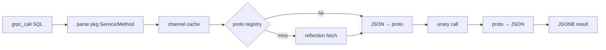

# pg_grpc

**Make gRPC calls directly from PostgreSQL SQL.**

No codegen. No middleware. No app-layer glue.

`pg_grpc` turns any gRPC service into a first-class SQL function call. Invoke RPCs from triggers, materialized views, scheduled jobs, or ad-hoc queries.


## How it looks

Define your service in a `.proto`:

```protobuf title="auth.proto"
syntax = "proto3";
package auth;

service AuthService {
  rpc GetUser(UserId) returns (User);
}

message UserId { string id = 1; }
message User {
  string id = 1;
  string email = 2;
}
```

Call it from SQL:

```sql
SELECT grpc_call(
  'localhost:50051',
  'auth.AuthService/GetUser',
  '{"id": "42"}'::jsonb
);
```

Get JSON back:

```json
{
  "id": "42",
  "email": "user@example.com"
}
```

## How it works



The proto registry is the cache. Reflection only fires on a miss; once a service is resolved, every subsequent call hits the cached descriptor pool. You can also pre-load schemas with [`grpc_proto_stage`](/guides/user-supplied-protos) to skip reflection entirely.

## Won't do (yet)

- **Streaming RPCs** — only unary methods are supported.
- **Pre-built binaries** — `cargo pgrx install --release` is the cross-platform path; Linux Debian-family users have a `.deb` from each release.
- **Cross-backend cache sharing** — every Postgres backend keeps its own channel cache, staged files, and registered services. Reconnecting resets them.

## Next

- [Install pg_grpc](/installation)
- [Quickstart](/quickstart)
- [Reference](/reference)
